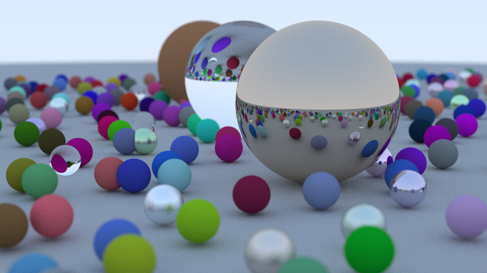

# About
This repo contains my personal ray tracer project following the content of the [Ray Tracing in One Weekend](https://raytracing.github.io/) book series.

# Results
**Milestone 1**: Basic ray tracing renderer for a 3D scene of spheres. Support shadowing and three materials with different reflection and refraction properties.

